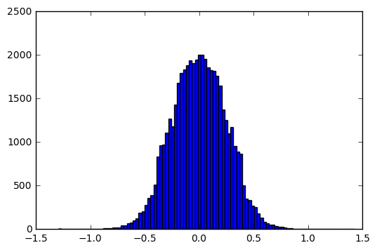

# behavioral-cloning

### Collection of data

I recorded the data by driving smoothly around the track1 and also drove the car for recovery situations but finally I found that udacity's sample data augmented by prepocessing techniques acheived a better result.

### Data Prepocessing

Data is augmented back and forth after running the model and based on mean square error values of training and validation data.

1. To simulate the recovery of vehicle I added left and right camera's images with adjustment of steering angle by 0.2 after lot of trial and error process.
2. To reduce overfitting and normalize the distrubution I used a method suggested by Vivek to displace the images horizontally.
3. Brightness is reduced randomly on the images which will help the model to generalize better on unseen data.
4. To balance the right and left steering angles images are flippped and added.
5. As the top and bottom portion of the images are noise for the model 55 pixels from the top and 25 pixels are removed.
6. Images are resized to 128 x 128 pixels to reduce the time taken by model to execute.

Here is the sample image and final distribution of angles.

### Model training

I tried different model architectures like Nvidia, comma.ai and finally settled with simple architecture which is less overfitting:

1. layer1 - Convolution layer: 3x3 filters followed by relu activation, 50% dropout and max pooling of 2x2
2. layer2 - Convolution layer: 3x3 filters followed by relu activation, 50% dropout and max pooling of 2x2
3. layer3 - flatten to final dense layer

### Training method:

1. Optimizer - Adam 
2. Epochs - 4
3. Training - 36162 images
4. Validation - 12054 images
